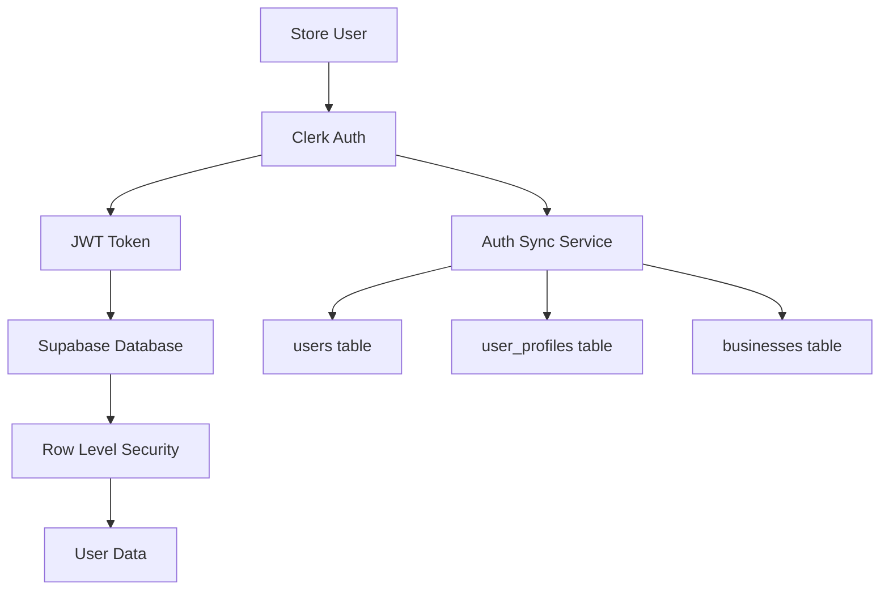
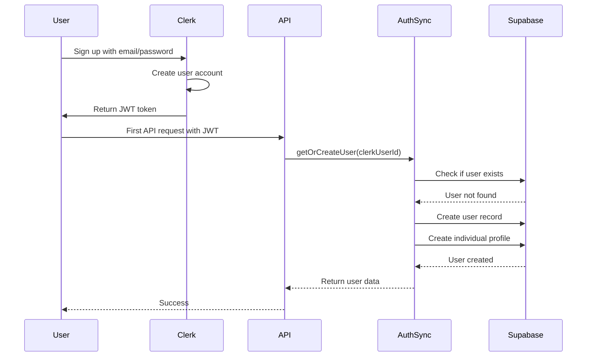
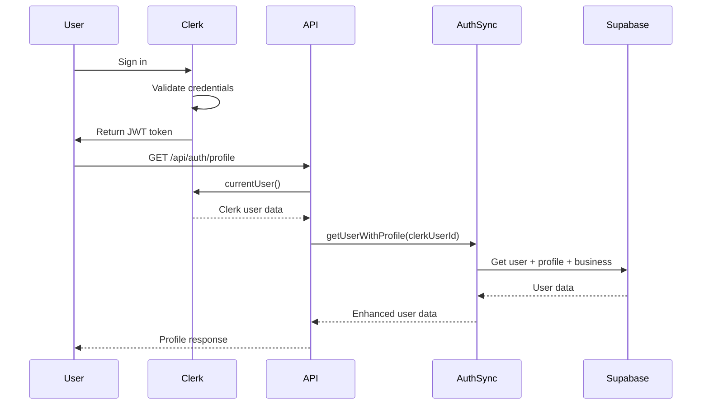
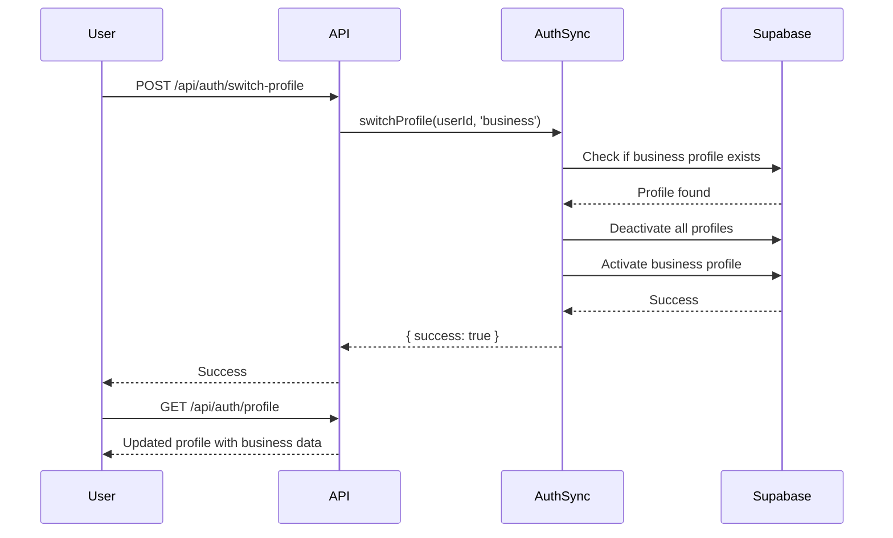
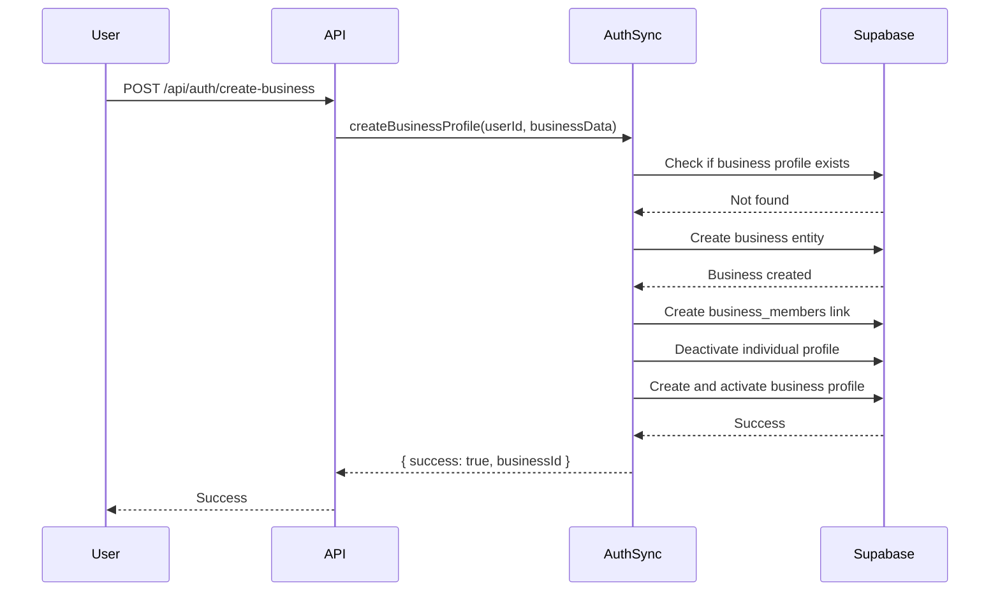

# Store Authentication Module Documentation

## Overview

The Cedar Elevators store authentication system uses **Clerk** for customer-facing authentication, integrated with **Supabase** for data persistence. This is separate from the admin authentication system which uses native Supabase Auth.

## Architecture



## Core Components

### 1. Authentication Libraries

#### Client-Side Auth (`src/lib/auth/client.ts`)
**Purpose**: Provides React hooks and utilities for client-side authentication

**Key Exports**:
- `useUser()` - Enhanced hook that returns user data with profile information
- `useClerk()` - Direct access to Clerk instance
- `useSignIn()` - Sign-in utilities from Clerk
- `useSignUp()` - Sign-up utilities from Clerk

**Types**:
```typescript
UserType = "guest" | "individual" | "business" | "verified"

EnhancedUser {
  clerkId: string
  userId: string
  email: string | null
  name: string | null
  imageUrl: string | null
  activeProfile: UserProfile | null
  business: Business | null
  userType: UserType
  isVerified: boolean
  hasBusinessProfile: boolean
}
```

**Key Features**:
- Profile caching (60-second cache duration)
- Request deduplication to prevent multiple simultaneous API calls
- Profile switching between individual and business
- Business profile creation

#### Server-Side Auth (`src/lib/auth/server.ts`)
**Purpose**: Server-side authentication utilities for API routes and server components

**Key Functions**:
- `getAuthUser()` - Get current authenticated user with full context
- `getUserType()` - Get user type (guest, individual, business, verified)
- `isAuthenticated()` - Check if user is authenticated
- `requireAuth()` - Require authentication (throws if not authenticated)
- `requireBusinessProfile()` - Require business profile
- `requireVerifiedBusiness()` - Require verified business account
- `getBusinessVerificationStatus()` - Get business verification status
- `getCompanyName()` - Get company name for business users
- `hasBusinessProfile()` - Check if user has business profile

**Return Type**:
```typescript
EnhancedAuthUser {
  clerkUser: { id, email, firstName, lastName }
  user: { id, clerk_user_id, email, phone, name }
  activeProfile: { id, profile_type, is_active }
  business?: { id, name, gst_number, verification_status }
  userType: UserType
  isVerified: boolean
}
```

### 2. Supabase Integration

#### Supabase Server Client (`src/lib/supabase/server.ts`)
**Purpose**: Create Supabase clients with proper authentication context

**Key Functions**:
- `createServerSupabase()` - Cookie-based auth for admin panel
- `createClerkSupabaseClient()` - Clerk JWT-based auth for store users
- `createServerSupabaseClient()` - Public client without auth
- `createAdminClient()` - Service role client (bypasses RLS)

**Clerk Integration**:
```typescript
// Uses Clerk token for Supabase requests
const clerkToken = await getToken()
headers.set('Authorization', `Bearer ${clerkToken}`)
```

### 3. Auth Synchronization Service

#### Auth Sync (`src/lib/services/auth-sync.ts`)
**Purpose**: Synchronize Clerk users with Supabase database

**Key Functions**:
- `getOrCreateUser(clerkUserId, clerkUserObj?)` - Get or create user in Supabase
- `getActiveProfile(userId)` - Get user's active profile
- `getUserWithProfile(clerkUserId, clerkUserObj?)` - Get user with profile and business
- `switchProfile(userId, profileType)` - Switch between individual/business profile
- `createBusinessProfile(userId, businessData)` - Create business profile
- `getUserBusiness(userId)` - Get user's business
- `hasBusinessProfile(userId)` - Check if user has business profile

**User Creation Flow**:
1. Check if user exists in Supabase by `clerk_user_id`
2. If exists, update user info from Clerk
3. If not exists, create new user and default individual profile
4. Return user data

### 4. API Routes

#### Profile API (`src/app/api/auth/profile/route.ts`)
**Endpoint**: `GET /api/auth/profile`

**Purpose**: Fetch current user's profile with business data

**Response**:
```json
{
  "clerkId": "user_xxx",
  "userId": "uuid",
  "email": "user@example.com",
  "name": "John Doe",
  "imageUrl": "https://...",
  "activeProfile": {
    "id": "uuid",
    "profile_type": "individual",
    "is_active": true
  },
  "business": null,
  "userType": "individual",
  "isVerified": false,
  "hasBusinessProfile": false
}
```

**Caching**: 60-second client-side cache via `Cache-Control` header

#### Switch Profile API (`src/app/api/auth/switch-profile/route.ts`)
**Endpoint**: `POST /api/auth/switch-profile`

**Purpose**: Switch between individual and business profiles

**Request Body**:
```json
{
  "profileType": "individual" | "business"
}
```

**Response**:
```json
{
  "success": true
}
```

#### Create Business API (`src/app/api/auth/create-business/route.ts`)
**Endpoint**: `POST /api/auth/create-business`

**Purpose**: Create a new business profile

**Request Body**:
```json
{
  "name": "Business Name",
  "gst_number": "optional",
  "pan_number": "optional"
}
```

#### User Type API (`src/app/api/auth/user-type/route.ts`)
**Endpoint**: `GET /api/auth/user-type`

**Purpose**: Get current user's type (guest, individual, business, verified)

### 5. Auth UI Components

#### Auth Routes (`src/app/(auth)/`)
Authentication pages with split-screen layout:

- `/sign-in` - Login page
- `/sign-up` - Registration page
- `/choose-type` - Account type selection
- `/individual-signup` - Individual registration
- `/business-signup` - Business registration
- `/forgot-password` - Password recovery
- `/reset-password` - Password reset
- `/verify-otp` - OTP verification
- `/sso-callback` - SSO callback handler

#### Auth Forms (`src/modules/auth/components/forms/`)

**Login Form** (`login-form.tsx`)
- Email/password login
- Social login options
- Remember me functionality
- Forgot password link

**Individual Register Form** (`individual-register-form.tsx`)
- Name, email, password fields
- Password strength indicator
- Terms acceptance
- Auto-sync with Supabase on registration

**Business Register Form** (`business-register-form.tsx`)
- Business name, GST, PAN fields
- Contact person details
- Company address
- Creates business profile on registration

**Account Type Selector** (`account-type-selector.tsx`)
- Choose between individual and business
- Visual cards for each type
- Redirects to appropriate registration flow

**Email OTP Form** (`email-otp-form.tsx`)
- OTP verification
- Resend OTP functionality

**Forgot Password Form** (`forgot-password-form.tsx`)
- Email input for password reset
- Sends reset link via Clerk

**Reset Password Form** (`reset-password-form.tsx`)
- New password input
- Password confirmation
- Password strength validation

#### Auth Layout (`src/modules/auth/components/auth-split-layout/`)
Split-screen layout with:
- Left side: Auth form
- Right side: Marketing content with images

#### Auth Guards (`src/components/guards/auth-only.tsx`)
**Purpose**: Protect routes that require authentication

**Usage**:
```tsx
<AuthOnly redirectTo="/sign-in">
  <ProtectedContent />
</AuthOnly>
```

**Props**:
- `children` - Content to render if authenticated
- `fallback` - Content to render if not authenticated
- `redirectTo` - Redirect URL for unauthenticated users

### 6. Database Tables

#### Users Table (`users`)
Stores core user information synced from Clerk

**Columns**:
- `id` (UUID) - Primary key
- `clerk_user_id` (TEXT) - Clerk user ID (format: `user_xxx`)
- `email` (TEXT) - User email
- `phone` (TEXT) - User phone number
- `name` (TEXT) - User full name
- `created_at` (TIMESTAMP)
- `updated_at` (TIMESTAMP)

**Indexes**:
- `idx_users_clerk_user_id` on `clerk_user_id`
- `idx_users_email` on `email`

#### User Profiles Table (`user_profiles`)
Manages individual and business profiles

**Columns**:
- `id` (UUID) - Primary key
- `user_id` (UUID) - References `users.id`
- `profile_type` (ENUM) - 'individual' or 'business'
- `is_active` (BOOLEAN) - Active profile flag
- `created_at` (TIMESTAMP)

**Constraints**:
- One active profile per user
- User can have both individual and business profiles

**RLS Policies**:
- Users can read their own profiles
- Users can update their own profiles
- Authenticated users can insert profiles

#### Businesses Table (`businesses`)
Stores business entity information

**Columns**:
- `id` (UUID) - Primary key
- `name` (TEXT) - Business name
- `gst_number` (TEXT) - GST registration number
- `pan_number` (TEXT) - PAN number
- `verification_status` (ENUM) - 'unverified', 'pending', 'verified', 'rejected'
- `verification_documents` (JSONB) - Document metadata
- `verification_requested_at` (TIMESTAMP)
- `verified_at` (TIMESTAMP)
- `verified_by` (UUID) - Admin who verified
- `verification_notes` (TEXT)
- `company_address` (TEXT)
- `contact_person` (TEXT)
- `contact_phone` (TEXT)
- `created_at` (TIMESTAMP)
- `updated_at` (TIMESTAMP)

#### Business Members Table (`business_members`)
Links users to businesses

**Columns**:
- `id` (UUID) - Primary key
- `business_id` (UUID) - References `businesses.id`
- `user_id` (UUID) - References `users.id`
- `role` (TEXT) - 'owner', 'admin', 'member'
- `created_at` (TIMESTAMP)

## Authentication Flow

### 1. User Registration Flow



### 2. User Login Flow



### 3. Profile Switching Flow



### 4. Business Profile Creation Flow



## Security Model

### Row Level Security (RLS)

The authentication system uses Clerk JWT tokens validated by Supabase:

**JWT Structure**:
```json
{
  "sub": "user_2abc123xyz",
  "email": "customer@example.com",
  "role": "authenticated",
  "aud": "authenticated"
}
```

**RLS Helper Functions**:
```sql
-- Extract Clerk user ID from JWT
CREATE FUNCTION get_current_user_id()
RETURNS text AS $$
BEGIN
  RETURN auth.jwt() ->> 'sub';
END;
$$ LANGUAGE plpgsql;
```

**Example RLS Policy**:
```sql
CREATE POLICY "Users can view own orders"
  ON orders FOR SELECT
  TO authenticated
  USING (clerk_user_id = get_current_user_id());
```

### Access Control

**Guest Users**:
- Can browse products
- Can view public content
- Cannot access cart, checkout, or profile

**Individual Users**:
- Can access all guest features
- Can add to cart and checkout
- Can view own orders
- Can manage profile
- Standard pricing

**Business Users (Unverified)**:
- All individual user features
- Can request verification
- Standard pricing

**Verified Business Users**:
- All business user features
- Business-exclusive pricing
- Bulk order capabilities
- Quote management
- Priority support

## File Structure

```
src/
├── lib/
│   ├── auth/
│   │   ├── client.ts              # Client-side auth hooks
│   │   ├── server.ts              # Server-side auth utilities
│   │   ├── admin-roles.ts         # Admin role definitions
│   │   └── index.ts               # Barrel exports
│   ├── services/
│   │   └── auth-sync.ts           # Clerk-Supabase sync service
│   ├── actions/
│   │   └── auth.ts                # Auth server actions
│   └── supabase/
│       ├── client.ts              # Supabase client utilities
│       └── server.ts              # Supabase server clients
├── modules/
│   └── auth/
│       ├── components/
│       │   ├── forms/
│       │   │   ├── login-form.tsx
│       │   │   ├── individual-register-form.tsx
│       │   │   ├── business-register-form.tsx
│       │   │   ├── account-type-selector.tsx
│       │   │   ├── email-otp-form.tsx
│       │   │   ├── forgot-password-form.tsx
│       │   │   └── reset-password-form.tsx
│       │   ├── auth-split-layout/
│       │   │   └── index.tsx
│       │   ├── password-strength-indicator.tsx
│       │   └── index.ts
│       ├── templates/
│       │   ├── login.tsx
│       │   ├── register.tsx
│       │   ├── choose-type.tsx
│       │   ├── individual-signup.tsx
│       │   ├── business-signup.tsx
│       │   ├── forgot-password.tsx
│       │   └── reset-password.tsx
│       └── index.ts
├── components/
│   └── guards/
│       └── auth-only.tsx          # Auth guard component
└── app/
    ├── (auth)/
    │   ├── sign-in/
    │   ├── sign-up/
    │   ├── choose-type/
    │   ├── individual-signup/
    │   ├── business-signup/
    │   ├── forgot-password/
    │   ├── reset-password/
    │   ├── verify-otp/
    │   ├── sso-callback/
    │   └── layout.tsx
    └── api/
        └── auth/
            ├── profile/
            │   └── route.ts       # GET user profile
            ├── switch-profile/
            │   └── route.ts       # POST switch profile
            ├── create-business/
            │   └── route.ts       # POST create business
            └── user-type/
                └── route.ts       # GET user type
```

## Environment Variables

Required environment variables for authentication:

```env
# Clerk Configuration
NEXT_PUBLIC_CLERK_PUBLISHABLE_KEY=pk_test_xxx
CLERK_SECRET_KEY=sk_test_xxx
NEXT_PUBLIC_CLERK_SIGN_IN_URL=/sign-in
NEXT_PUBLIC_CLERK_SIGN_UP_URL=/sign-up
NEXT_PUBLIC_CLERK_AFTER_SIGN_IN_URL=/
NEXT_PUBLIC_CLERK_AFTER_SIGN_UP_URL=/

# Supabase Configuration
NEXT_PUBLIC_SUPABASE_URL=https://xxx.supabase.co
NEXT_PUBLIC_SUPABASE_ANON_KEY=eyJxxx
SUPABASE_SERVICE_ROLE_KEY=eyJxxx
```

## Usage Examples

### Client-Side Usage

```tsx
import { useUser } from '@/lib/auth/client'

function ProfileComponent() {
  const { user, isLoaded, switchProfile, createBusinessProfile } = useUser()

  if (!isLoaded) return <div>Loading...</div>
  if (!user) return <div>Not authenticated</div>

  const handleSwitchToBusiness = async () => {
    try {
      await switchProfile('business')
      console.log('Switched to business profile')
    } catch (error) {
      console.error('Failed to switch profile:', error)
    }
  }

  const handleCreateBusiness = async () => {
    try {
      await createBusinessProfile({
        name: 'My Business',
        gst_number: 'GST123',
        pan_number: 'PAN123'
      })
      console.log('Business profile created')
    } catch (error) {
      console.error('Failed to create business:', error)
    }
  }

  return (
    <div>
      <h1>Welcome, {user.name}</h1>
      <p>User Type: {user.userType}</p>
      <p>Active Profile: {user.activeProfile?.profile_type}</p>
      
      {user.hasBusinessProfile && (
        <button onClick={handleSwitchToBusiness}>
          Switch to Business
        </button>
      )}
      
      {!user.hasBusinessProfile && (
        <button onClick={handleCreateBusiness}>
          Create Business Profile
        </button>
      )}
    </div>
  )
}
```

### Server-Side Usage

```tsx
import { getAuthUser, requireAuth, requireVerifiedBusiness } from '@/lib/auth/server'

// In a Server Component
export default async function ProfilePage() {
  const authUser = await getAuthUser()
  
  if (!authUser) {
    redirect('/sign-in')
  }

  return (
    <div>
      <h1>Welcome, {authUser.user.name}</h1>
      <p>Email: {authUser.user.email}</p>
      <p>User Type: {authUser.userType}</p>
    </div>
  )
}

// In an API Route
export async function GET(request: Request) {
  try {
    const authUser = await requireAuth()
    
    // User is authenticated, proceed with logic
    return Response.json({ user: authUser })
  } catch (error) {
    return Response.json({ error: 'Unauthorized' }, { status: 401 })
  }
}

// Require verified business
export async function POST(request: Request) {
  try {
    const authUser = await requireVerifiedBusiness()
    
    // User is a verified business, proceed with business logic
    return Response.json({ success: true })
  } catch (error) {
    return Response.json({ error: 'Verified business required' }, { status: 403 })
  }
}
```

### Using Supabase with Clerk Auth

```tsx
import { createClerkSupabaseClient } from '@/lib/supabase/server'

export async function GET(request: Request) {
  const supabase = await createClerkSupabaseClient()
  
  // RLS policies automatically filter data for current user
  const { data: orders, error } = await supabase
    .from('orders')
    .select('*')
  
  if (error) {
    return Response.json({ error: error.message }, { status: 500 })
  }
  
  return Response.json({ orders })
}
```

## Best Practices

1. **Always use `getAuthUser()` on the server** instead of directly calling Clerk's `currentUser()` to get full profile context

2. **Cache profile data on the client** - The `useUser()` hook implements 60-second caching to reduce API calls

3. **Use auth guards** for protected routes:
   ```tsx
   <AuthOnly redirectTo="/sign-in">
     <ProtectedContent />
   </AuthOnly>
   ```

4. **Validate user type** before showing business-specific features:
   ```tsx
   {user.userType === 'verified' && <BusinessFeature />}
   ```

5. **Use RLS policies** instead of manual filtering in queries - let Supabase handle access control

6. **Handle profile switching gracefully** - Always refresh the page or refetch data after profile switches

7. **Use service role sparingly** - Only use `createAdminClient()` when absolutely necessary and in secure server contexts

## Troubleshooting

### User not syncing to Supabase
- Check that Clerk-Supabase integration is enabled
- Verify JWT token includes required claims
- Check `auth-sync.ts` logs for errors

### Profile not loading
- Clear browser cache
- Check `/api/auth/profile` response
- Verify user has an active profile in database

### RLS policies blocking access
- Check if user is authenticated
- Verify `clerk_user_id` matches in database
- Test RLS policies in Supabase SQL editor

### Business profile creation fails
- Check if user already has a business profile
- Verify business data is valid
- Check database constraints and foreign keys

## Related Documentation

- [AUTHENTICATION-ARCHITECTURE.md](file:///d:/web%20development/cedar/cedarelevators/AUTHENTICATION-ARCHITECTURE.md) - Complete authentication architecture
- [ARCHITECTURE.md](file:///d:/web%20development/cedar/cedarelevators/docs/ARCHITECTURE.md) - Overall system architecture
- Clerk Documentation: https://clerk.com/docs
- Supabase Auth Documentation: https://supabase.com/docs/guides/auth
