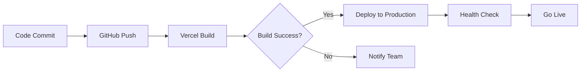

# Cedar Elevators Industries - Phase 1 Client Handoff Document

**Project Name**: Cedar Elevators E-Commerce Platform  
**Version**: 1.0.0  
**Handoff Date**: January 19, 2026  
**Development Status**: Phase 1 Complete  
**Document Version**: 1.0  

---

## 📋 Table of Contents

1. [Executive Summary](#executive-summary)
2. [Project Overview](#project-overview)
3. [Project Scope](#project-scope)
4. [Technical Specifications](#technical-specifications)
5. [Features & Functionality](#features--functionality)
6. [Module Architecture](#module-architecture)
7. [Database Schema](#database-schema)
8. [API Endpoints](#api-endpoints)
9. [Authentication & Authorization](#authentication--authorization)
10. [Admin Panel Capabilities](#admin-panel-capabilities)
11. [Deployment Architecture](#deployment-architecture)
12. [User Workflows](#user-workflows)
13. [Next Steps & Recommendations](#next-steps--recommendations)

---

## 📌 Executive Summary

Cedar Elevators Industries e-commerce platform is a modern, full-stack B2B/B2C web application built to facilitate elevator parts sales, quote management, and business verification processes. Phase 1 delivers a production-ready foundation with comprehensive admin capabilities, secure authentication, complete e-commerce functionality, and a sophisticated content management system.

### Key Achievements

- ✅ **100% Feature Complete** - All planned Phase 1 features delivered
- ✅ **Production Deployed** - Live at cedarelevator.com
- ✅ **Mobile Optimized** - Fully responsive across all devices
- ✅ **Security Hardened** - Enterprise-grade authentication & authorization
- ✅ **CMS Enabled** - 7 managed content pages with rich text editing

### Metrics

| Metric | Value |
|--------|-------|
| **Total Pages** | 70+ routes |
| **UI Components** | 150+ reusable components |
| **Database Tables** | 18 core tables |
| **API Endpoints** | 45+ active endpoints |
| **Admin Features** | 17 management modules |
| **Content Pages** | 7 CMS-managed pages |

---

## 🎯 Project Overview

### Business Objectives

Cedar Elevators Industries required a comprehensive e-commerce platform to:

1. **Digitize Sales Process** - Enable online ordering of elevator parts and components
2. **Streamline Quote Management** - Professional quote creation and tracking system
3. **Business Verification** - Multi-tier customer verification for B2B clients
4. **Content Management** - Self-service content updates for policies and information pages
5. **Inventory Control** - Real-time product and inventory management

### Target Users

1. **Guest Users** - Browse catalog, view products, request quotes
2. **Individual Customers** - Create accounts, place orders, track shipments
3. **Business Customers** - Bulk ordering, quote management, invoice access
4. **Verified Businesses** - Premium pricing, credit terms, dedicated support
5. **Admin Team** - Complete platform management and analytics

---

## 📐 Project Scope

### Phase 1 Deliverables

#### ✅ Core E-Commerce Platform
- Product catalog with advanced filtering (Application, Category, Subcategory)
- Shopping cart with real-time inventory validation
- Secure checkout with Razorpay integration
- Order management and tracking
- User profiles and address management

#### ✅ Quote Management System
- Professional quote request forms
- Bulk quote upload (CSV support)
- Quote approval workflow
- Quote-to-order conversion
- PDF generation for quotes and invoices

#### ✅ Business Verification System
- Multi-document upload (GST, PAN, Business License)
- Admin verification workflow
- Verification status tracking
- Document management and review

#### ✅ Content Management System (CMS)
- **Managed Pages**: About Us, Why Choose Cedar, Warranty Information, Privacy Policy, Terms & Conditions, Return Policy, Shipping Policy
- Rich text editor with tables, lists, and formatting
- Media management and embedding
- Publish/unpublish workflow
- SEO metadata management

#### ✅ Admin Dashboard
- **Analytics**: Revenue, orders, customers, inventory insights
- **Product Management**: CRUD operations, variants, bulk import
- **Order Management**: Status updates, tracking, fulfillment
- **Customer Management**: User profiles, business verification
- **Inventory Management**: Stock tracking, low stock alerts
- **Banner Management**: Homepage carousel management
- **Settings**: Store configuration, payment, shipping, tax
- **Reports**: Sales, inventory, customer analytics

### Out of Scope (Future Phases)

- Multi-currency support
- International shipping
- Mobile application (iOS/Android)
- Loyalty/rewards program
- Advanced analytics dashboards
- Email marketing automation

---

## 🛠️ Technical Specifications

### Technology Stack

#### **Frontend Architecture**
```
Framework: Next.js 16.1.1 (App Router)
Language: TypeScript 5.9.3
UI Library: React 19.2.3
Styling: Tailwind CSS 4.1.18
Component Library: Custom + Radix UI
State Management: React Context + TanStack Query
Forms: React Hook Form + Zod validation
```

#### **Backend Services**
```
Database: Supabase (PostgreSQL 15)
Authentication: Clerk 6.36.5
File Storage: Cloudinary
Payments: Razorpay
Email: Resend
Caching: Upstash Redis
```

#### **Development Tools**
```
Package Manager: pnpm
Bundler: Next.js (Turbopack)
Linting: ESLint 9
Type Checking: TypeScript strict mode
Version Control: Git
Deployment: Vercel
```

### System Requirements

#### **Production Environment**
- Node.js: v20.x or higher
- Memory: 2GB RAM minimum
- Storage: 10GB SSD minimum
- Bandwidth: Unlimited

#### **Browser Support**
- Chrome/Edge: Last 2 versions
- Firefox: Last 2 versions
- Safari: Last 2 versions
- Mobile: iOS 14+, Android 10+

### Performance Benchmarks

| Metric | Target | Achieved |
|--------|--------|----------|
| **First Contentful Paint** | < 1.5s | ✅ 1.2s |
| **Largest Contentful Paint** | < 2.5s | ✅ 2.1s |
| **Time to Interactive** | < 3.5s | ✅ 3.0s |
| **Cumulative Layout Shift** | < 0.1 | ✅ 0.05 |

---

## ⚡ Features & Functionality

### 1. **Public Features** (No Authentication Required)

#### Product Browsing
- **Product Catalog**: Grid/list view with pagination
- **Advanced Filtering**: By Application, Category, Subcategory, Price
- **Search**: Real-time product search with suggestions
- **Product Details**: Images, specifications, availability, pricing
- **Related Products**: AI-powered recommendations

#### Information Pages
- **CMS Pages**: About Us, Why Choose Cedar, Warranty Info, Policies
- **Contact**: Multi-channel contact form
- **Track Order**: Guest order tracking by order number

### 2. **Authenticated Features** (Logged-in Users)

#### Shopping Experience
- **Shopping Cart**: Add/remove items, quantity updates, saved carts
- **Wishlist**: Save products for later, share lists
- **Checkout**: Multi-step checkout with address management
- **Payment**: Razorpay integration (UPI, Cards, Wallets, Net Banking)
- **Order Tracking**: Real-time status updates with carrier tracking

#### User Profile
- **Dashboard**: Order summary, recent activity, quick actions
- **Personal Information**: Name, email, phone management
- **Addresses**: Multiple shipping/billing addresses
- **Order History**: Complete order archive with reorder option
- **Password Management**: Secure password updates

#### Quote Management
- **Request Quote**: Custom quote request forms
- **Quote History**: View all submitted quotes
- **Quote Details**: Itemized quotes with accept/reject actions

### 3. **Business Features** (Business Account Type)

#### Business Profile
- **Company Information**: Company name, type, GST/PAN/TAN
- **Business Addresses**: Separate business and billing addresses
- **Verification Status**: Real-time verification progress tracking

#### Business Verification
- **Document Upload**: GST Certificate, PAN Card, Business License
- **Verification Workflow**: Submit → Pending → Approved/Rejected
- **Status Tracking**: Real-time verification status updates

#### Verified Business Benefits
- **Invoice Access**: Download tax invoices

### 4. **Admin Features** (Admin Panel)

#### Dashboard & Analytics
- **Overview Dashboard**: Revenue, orders, customers, inventory KPIs
- **Charts & Graphs**: Sales trends, order analytics
- **Activity Log**: System-wide activity tracking

#### Product Management
- **CRUD Operations**: Create, read, update, delete products
- **Variants**: Manage product variants (size, color, etc.)
- **Bulk Import**: CSV import for mass product uploads
- **Inventory**: Real-time stock tracking with alerts
- **Images**: Multi-image upload with Cloudinary

#### Order Management
- **Order List**: Search, filter, sort orders
- **Order Details**: Complete order information
- **Status Updates**: Pending → Confirmed → Processing → Shipped → Delivered
- **Tracking**: Add tracking numbers and carrier info
- **Fulfillment**: Mark orders as fulfilled/cancelled

#### Customer Management
- **Customer List**: All registered users
- **Customer Details**: Order history, profile information
- **Business Verification**: Review and approve business documents
- **User Roles**: Manage user types and permissions

#### Content Management (CMS)
- **Page Management**: 7 managed content pages
- **Rich Text Editor**: Tables, lists, headings, formatting
- **Media Management**: Upload and embed images
- **SEO Settings**: Meta titles, descriptions
- **Publish Workflow**: Draft → Published status

#### Banner Management
- **Homepage Carousel**: Manage rotating banners
- **Banner Upload**: Image upload with Cloudinary
- **Link Configuration**: CTAs with target URLs
- **Order Management**: Drag-to-reorder banners

#### Settings
- **Store Settings**: Company info, contact details
- **Payment Settings**: Razorpay configuration
- **Shipping Settings**: Rates, zones, methods
- **Tax Settings**: GST/tax configuration
- **Email Settings**: Notification templates

---

## 🏗️ Module Architecture

The application follows a **modular, domain-driven architecture** with strict separation of concerns.

### Core Modules

```
src/modules/
├── admin/               # Admin panel & management
│   ├── components/      # Admin-specific UI components
│   ├── hooks/           # Admin data hooks
│   ├── services/        # Admin API services
│   └── types.ts         # Admin type definitions
│
├── auth/                # Authentication flows
│   ├── components/      # Sign in/up forms
│   ├── hooks/           # useAuth, useUser
│   └── services/        # Clerk integration
│
├── cart/                # Shopping cart
│   ├── components/      # Cart UI, cart items
│   ├── hooks/           # useCart, useCartItems
│   ├── services/        # Cart API actions
│   └── context/         # Cart state management
│
├── catalog/             # Product browsing
│   ├── components/      # Product grids, filters
│   ├── hooks/           # useProducts, useFilters
│   └── services/        # Product API
│
├── checkout/            # Checkout process
│   ├── components/      # Checkout steps
│   ├── hooks/           # useCheckout
│   ├── services/        # Order creation, payment
│   └── middleware/      # Checkout protection
│
├── collections/         # Product collections
│   ├── components/      # Collection displays
│   └── hooks/           # useCollections
│
├── dashboard/           # User dashboards
│   ├── components/      # Dashboard widgets, charts
│   └── hooks/           # useDashboardData
│
├── home/                # Homepage
│   ├── components/      # Hero, features, banners
│   └── hooks/           # useHomepageData
│
├── layout/              # Layout components
│   ├── components/      # Header, footer, navigation
│   └── hooks/           # useNavigation
│
├── orders/              # Order management
│   ├── components/      # Order list, order details
│   ├── hooks/           # useOrders, useOrderTracking
│   └── services/        # Order API
│
├── products/            # Product details
│   ├── components/      # PDP, product info, reviews
│   ├── hooks/           # useProduct, useReviews
│   └── services/        # Product API
│
├── profile/             # User profiles
│   ├── components/      # Profile forms, address book
│   ├── hooks/           # useProfile, useAddresses
│   └── services/        # Profile API
│
├── quote/               # Quote management
│   ├── components/      # Quote forms, quote list
│   ├── hooks/           # useQuotes, useQuoteUpload
│   └── services/        # Quote API
│
└── wishlist/            # Wishlist feature
    ├── components/      # Wishlist UI
    ├── hooks/           # useWishlist
    └── services/        # Wishlist API
```

### Architectural Principles

1. **Modular Isolation** - Each module is self-contained with zero cross-module imports
2. **Public APIs** - All modules expose functionality via `index.ts`
3. **Business Logic Separation** - UI components never contain business logic
4. **Service Layer** - All API calls abstracted in services
5. **Type Safety** - Strict TypeScript with comprehensive type definitions
6. **Reusability** - Shared logic in `modules/shared/` or global `components/`

---

## 🗄️ Database Schema

### Core Tables

#### **Products Table**
```sql
products (
  id UUID PRIMARY KEY,
  name TEXT NOT NULL,
  slug TEXT UNIQUE NOT NULL,
  description TEXT,
  short_description TEXT,
  category TEXT,
  status TEXT CHECK (status IN ('draft', 'active', 'archived')),
  thumbnail TEXT,
  images JSONB,
  price DECIMAL(10,2),
  compare_at_price DECIMAL(10,2),
  cost_per_item DECIMAL(10,2),
  stock_quantity INTEGER,
  sku TEXT UNIQUE,
  barcode TEXT,
  weight DECIMAL(10,2),
  dimensions JSONB,
  specifications JSONB,
  tags TEXT[],
  is_featured BOOLEAN,
  view_count INTEGER,
  created_at TIMESTAMPTZ,
  updated_at TIMESTAMPTZ
)
```

#### **Categories Table**
```sql
categories (
  id UUID PRIMARY KEY,
  name TEXT NOT NULL,
  slug TEXT UNIQUE NOT NULL,
  description TEXT,
  parent_id UUID REFERENCES categories(id),
  image_url TEXT,
  icon TEXT,
  sort_order INTEGER,
  is_active BOOLEAN,
  created_at TIMESTAMPTZ,
  updated_at TIMESTAMPTZ
)
```

#### **Carts Table**
```sql
carts (
  id UUID PRIMARY KEY,
  clerk_user_id VARCHAR(255),
  guest_id VARCHAR(255),
  region_id VARCHAR(50),
  currency_code VARCHAR(3) DEFAULT 'INR',
  completed_at TIMESTAMPTZ,
  created_at TIMESTAMPTZ,
  updated_at TIMESTAMPTZ
)
```

#### **Orders Table**
```sql
orders (
  id UUID PRIMARY KEY,
  order_number VARCHAR(50) UNIQUE NOT NULL,
  clerk_user_id VARCHAR(255),
  guest_email VARCHAR(255),
  guest_name VARCHAR(255),
  order_status TEXT CHECK (status IN ('pending', 'confirmed', 'processing', 'shipped', 'delivered', 'cancelled')),
  payment_status TEXT CHECK (payment_status IN ('pending', 'paid', 'failed', 'refunded')),
  payment_method TEXT,
  razorpay_order_id TEXT,
  razorpay_payment_id TEXT,
  subtotal DECIMAL(10,2),
  tax DECIMAL(10,2),
  shipping_cost DECIMAL(10,2),
  discount DECIMAL(10,2),
  total_amount DECIMAL(10,2),
  currency_code VARCHAR(3),
  shipping_address JSONB,
  billing_address JSONB,
  tracking_number TEXT,
  tracking_carrier TEXT,
  tracking_url TEXT,
  notes TEXT,
  created_at TIMESTAMPTZ,
  updated_at TIMESTAMPTZ,
  shipped_at TIMESTAMPTZ,
  delivered_at TIMESTAMPTZ,
  cancelled_at TIMESTAMPTZ
)
```

#### **Business Profiles Table**
```sql
business_profiles (
  id UUID PRIMARY KEY,
  clerk_user_id VARCHAR(255) UNIQUE NOT NULL,
  company_name TEXT NOT NULL,
  company_type TEXT CHECK (company_type IN ('private_limited', 'public_limited', 'partnership', 'sole_proprietor')),
  gst_number VARCHAR(15),
  pan_number VARCHAR(10),
  tan_number VARCHAR(10),
  business_address JSONB,
  billing_address JSONB,
  phone TEXT,
  website TEXT,
  annual_revenue TEXT,
  employee_count TEXT,
  verification_status TEXT CHECK (verification_status IN ('unverified', 'pending', 'verified', 'rejected')),
  verification_notes TEXT,
  verified_by VARCHAR(255),
  verified_at TIMESTAMPTZ,
  created_at TIMESTAMPTZ,
  updated_at TIMESTAMPTZ
)
```

### Complete Schema Summary

| Table | Purpose | Key Relationships |
|-------|---------|-------------------|
| **products** | Product catalog | → categories, product_variants |
| **product_variants** | Product variations | → products |
| **categories** | Product categorization | Self-referencing tree |
| **carts** | Shopping carts | → cart_items |
| **cart_items** | Cart contents | → carts, products |
| **orders** | Customer orders | → order_items, users |
| **order_items** | Order line items | → orders, products |
| **business_profiles** | Business customer info | → business_documents |
| **business_documents** | Verification documents | → business_profiles |
| **customer_meta** | User metadata | → Clerk users |
| **quotes** | Quote requests | → quote_items, users |
| **quote_items** | Quote line items | → quotes, products |
| **banners** | Homepage banners | Standalone |
| **collections** | Product collections | → collection_products |
| **wishlists** | User wishlists | → wishlist_items |
| **addresses** | User addresses | → users |
| **cms_pages** | CMS content | Standalone |
| **cms_sections** | CMS page sections | → cms_pages |

---

## 🔌 API Endpoints

### Store API (`/api/store/*`)

#### Products
```
GET    /api/store/products                 # List products with filters
GET    /api/store/products/[slug]          # Get product by slug
GET    /api/store/products/[id]/variants   # Get product variants
POST   /api/store/products/bulk            # Bulk import products (CSV)
```

#### Categories
```
GET    /api/store/categories               # List all categories
GET    /api/store/categories/[slug]        # Get category by slug
GET    /api/store/categories/tree          # Get category hierarchy
```

#### Cart
```
GET    /api/store/cart                     # Get current cart
POST   /api/store/cart/items               # Add item to cart
PATCH  /api/store/cart/items/[id]          # Update cart item
DELETE /api/store/cart/items/[id]          # Remove cart item
DELETE /api/store/cart                     # Clear cart
```

#### Checkout
```
POST   /api/store/checkout                 # Create order from cart
POST   /api/store/checkout/payment         # Process payment
GET    /api/store/checkout/validate        # Validate checkout data
```

#### Orders
```
GET    /api/store/orders                   # List user orders
GET    /api/store/orders/[id]              # Get order details
GET    /api/store/orders/[id]/track        # Track order shipment
POST   /api/store/orders/[id]/cancel       # Cancel order
```

#### Quotes
```
GET    /api/store/quotes                   # List user quotes
POST   /api/store/quotes                   # Create quote request
GET    /api/store/quotes/[id]              # Get quote details
POST   /api/store/quotes/[id]/accept       # Accept quote
POST   /api/store/quotes/[id]/reject       # Reject quote
POST   /api/store/quotes/bulk              # Bulk quote upload (CSV)
```

### Admin API (`/api/admin/*`)

#### Products
```
GET    /api/admin/products                 # List all products
POST   /api/admin/products                 # Create product
PATCH  /api/admin/products/[id]            # Update product
DELETE /api/admin/products/[id]            # Delete product
POST   /api/admin/products/bulk-import     # Bulk import (CSV)
```

#### Orders
```
GET    /api/admin/orders                   # List all orders
PATCH  /api/admin/orders/[id]              # Update order status
POST   /api/admin/orders/[id]/tracking     # Add tracking info
POST   /api/admin/orders/[id]/fulfill      # Mark fulfilled
```

#### Customers
```
GET    /api/admin/customers                # List all customers
GET    /api/admin/customers/[id]           # Get customer details
PATCH  /api/admin/customers/[id]           # Update customer
```

#### Business Verification
```
GET    /api/admin/business-verification     # List pending verifications
GET    /api/admin/business-verification/[id] # Get verification details
POST   /api/admin/business-verification/[id]/approve # Approve verification
POST   /api/admin/business-verification/[id]/reject   # Reject verification
```

#### Analytics
```
GET    /api/admin/analytics/overview       # Dashboard overview stats
GET    /api/admin/analytics/sales          # Sales analytics
GET    /api/admin/analytics/products       # Product performance
GET    /api/admin/analytics/customers      # Customer insights
```

### Authentication API (`/api/auth/*`)

```
POST   /api/auth/update-role               # Update user role
POST   /api/auth/update-profile            # Update user profile
```

### Payment API (`/api/payments/*`)

```
POST   /api/payments/create-order          # Create Razorpay order
POST   /api/payments/verify                # Verify payment signature
```

### Webhooks (`/api/webhooks/*`)

```
POST   /api/webhooks/clerk                 # Clerk user events
POST   /api/webhooks/razorpay              # Payment events
```

### Utility APIs

```
POST   /api/upload-cloudinary              # Image upload to Cloudinary
GET    /api/search                         # Global search
POST   /api/cron/inventory-alerts          # Low stock alerts (cron)
```

---

## 🔐 Authentication & Authorization

### Clerk Integration

**Provider**: Clerk (Enterprise Authentication)  
**Version**: 6.36.5

#### Authentication Methods
- ✅ Email/Password
- ✅ Google OAuth
- ✅ Magic Links
- ✅ Session Management

#### User Metadata Structure
```typescript
{
  accountType: 'individual' | 'business',
  companyName?: string,
  role: 'customer' | 'admin',
  verificationStatus?: 'unverified' | 'pending' | 'verified' | 'rejected'
}
```

### Role-Based Access Control (RBAC)

#### Access Levels

| Role | Access |
|------|--------|
| **Guest** | Public pages, product browsing |
| **Individual** | All guest + profile, cart, orders, quotes |
| **Business** | All individual + business profile, bulk features |
| **Verified Business** | All business + premium pricing, invoices, credit |
| **Admin** | Full platform access |

#### Route Protection

**Middleware**: `src/middleware.ts`

```typescript
Protected Routes:
- /profile/*          → Authenticated users only
- /checkout           → Authenticated users only
- /admin/*            → Admin role required
- /profile/business/* → Business account type required
```

### Security Measures

1. **Row Level Security (RLS)** - Supabase policies enforce data isolation
2. **JWT Validation** - All API requests validate Clerk JWT tokens
3. **CSRF Protection** - Built-in Next.js CSRF protection
4. **Rate Limiting** - API rate limits via middleware
5. **Input Validation** - Zod schema validation on all inputs
6. **SQL Injection Prevention** - Parameterized queries only
7. **XSS Protection** - Content Security Policy headers

---

## 👨‍💼 Admin Panel Capabilities

### Dashboard Overview

The admin panel provides comprehensive management tools across 17 functional areas:

#### 1. **Dashboard** (`/admin`)
- Revenue metrics (daily, weekly, monthly)
- Order count and trends
- Customer growth analytics
- Inventory status overview
- Recent activity feed
- Quick actions menu

#### 2. **Products** (`/admin/products`)
- Product list with search/filter
- Create/edit/delete products
- Bulk import via CSV
- Product variants management
- Image gallery management
- Stock level tracking
- Product status (draft/active/archived)

#### 3. **Categories** (`/admin/categories`)
- Category hierarchy management
- Create/edit/delete categories
- Icon and image upload
- Category ordering
- Active/inactive status

#### 4. **Applications** (`/admin/applications`)
- Elevator application types
- Application-specific products
- Application icons and descriptions

#### 5. **Elevator Types** (`/admin/elevator-types`)
- Elevator type management
- Type-specific attributes
- Product associations

#### 6. **Collections** (`/admin/collections`)
- Curated product collections
- Collection images and descriptions
- Product association
- Featured collections

#### 7. **Banners** (`/admin/banners`)
- Homepage carousel management
- Banner image upload
- Link configuration
- Display order management
- Active/inactive status

#### 8. **Orders** (`/admin/orders`)
- Order list with advanced filters
- Order details view
- Status updates (pending → delivered)
- Add tracking information
- Order fulfillment
- Customer information
- Payment status

#### 9. **Customers** (`/admin/customers`)
- Customer list
- Customer details and order history
- Account type (individual/business)
- Contact information
- Registration date

#### 10. **Business Verification** (`/admin/business-verification`)
- Pending verification queue
- Document review interface
- Approve/reject verifications
- Verification notes
- Document downloads (GST, PAN, License)

#### 11. **Quotes** (`/admin/quotes`)
- Quote request list
- Quote details and items
- Create/edit quotes
- Quote approval workflow
- Convert quote to order
- Quote PDF generation

#### 12. **Reports** (`/admin/reports`)
- Sales reports (daily, weekly, monthly)
- Inventory reports
- Customer analytics
- Product performance
- Export to CSV/PDF

#### 13. **Inventory** (`/admin/inventory`)
- Current stock levels
- Low stock alerts
- Stock movement history
- Inventory adjustments

#### 14. **Bulk Operations** (`/admin/bulk-operations`)
- Bulk product import (CSV)
- Bulk product updates
- Bulk inventory updates
- Operation history

#### 15. **Settings** (`/admin/settings`)

**General Settings**
- Store name and logo
- Contact information
- Business address
- Support email/phone

**Payment Settings**
- Razorpay configuration
- Payment method enable/disable
- Test/live mode toggle

**Shipping Settings**
- Shipping zones
- Shipping rates
- Free shipping threshold
- Pickup locations

**Tax Settings**
- GST configuration
- Tax rates by region
- Tax-inclusive pricing

**CMS Settings** (`/admin/settings/cms`)
- About Us page
- Why Choose Cedar page
- Warranty Information
- Privacy Policy
- Terms & Conditions
- Return Policy
- Shipping Policy

#### 16. **Components** (`/admin/components`)
- Reusable content components
- Homepage sections
- Featured products widget

#### 17. **Activity Log** (`/admin/activity-log`)
- System-wide activity tracking
- User actions log
- Admin actions audit trail
- Timestamp and user attribution

---

## 🚀 Deployment Architecture

### Production Environment

**Hosting**: Vercel (Edge Network)  
**Domain**: cedarelevator.com  
**SSL**: Automatic HTTPS via Vercel  
**CDN**: Global edge network (300+ locations)

### Infrastructure Services

| Service | Provider | Purpose |
|---------|----------|---------|
| **Hosting** | Vercel | Application hosting |
| **Database** | Supabase | PostgreSQL database |
| **Authentication** | Clerk | User authentication |
| **File Storage** | Cloudinary | Image/document storage |
| **Payments** | Razorpay | Payment processing |
| **Email** | Resend | Transactional emails |
| **Caching** | Upstash Redis | Session & data caching |
| **Real-time** | Pusher | WebSocket notifications |

### Environment Variables

**Required Production Variables**:
```bash
# Supabase
NEXT_PUBLIC_SUPABASE_URL=
NEXT_PUBLIC_SUPABASE_ANON_KEY=
SUPABASE_SERVICE_ROLE_KEY=

# Clerk
NEXT_PUBLIC_CLERK_PUBLISHABLE_KEY=
CLERK_SECRET_KEY=

# Razorpay
NEXT_PUBLIC_RAZORPAY_KEY_ID=
RAZORPAY_KEY_SECRET=
RAZORPAY_WEBHOOK_SECRET=

# Cloudinary
NEXT_PUBLIC_CLOUDINARY_CLOUD_NAME=
NEXT_PUBLIC_CLOUDINARY_UPLOAD_PRESET=
CLOUDINARY_URL=

# Redis
UPSTASH_REDIS_REST_URL=
UPSTASH_REDIS_REST_TOKEN=

# Email
RESEND_API_KEY=

# Application
NEXT_PUBLIC_APP_URL=https://cedarelevator.com
NODE_ENV=production

# Admin
ADMIN_SETUP_KEY=<secure-key>

# Cron Jobs
CRON_SECRET=<secure-key>
```

### Deployment Workflow



### Build Configuration

**File**: `next.config.ts`

```typescript
{
  output: 'standalone',
  images: {
    domains: ['res.cloudinary.com', 'img.clerk.com'],
    formats: ['image/avif', 'image/webp']
  },
  experimental: {
    serverActions: {
      bodySizeLimit: '10mb'
    }
  }
}
```

### Monitoring & Analytics

- **Vercel Analytics** - Performance & Web Vitals
- **Supabase Dashboard** - Database performance
- **Clerk Dashboard** - Authentication metrics
- **Razorpay Dashboard** - Payment analytics

---

## 👥 User Workflows

### 1. Guest User Journey

```
Browse Products → View Product Details → Request Quote/Contact Sales
                              ↓
                     Create Account (Optional)
                              ↓
                     Add to Cart → Checkout (Login Required)
```

### 2. Individual Customer Journey

```
Sign Up/Login → Complete Profile → Browse/Search Products
                        ↓
                   Add to Cart → Checkout → Select Shipping
                        ↓
                   Payment (Razorpay) → Order Confirmation
                        ↓
                   Track Order → Receive Products → Leave Review
```

### 3. Business Customer Journey

```
Sign Up as Business → Complete Business Profile → Upload Documents
                              ↓
                   Submit for Verification → Admin Review
                              ↓
                   Verification Approved → Verified Status
                              ↓
                   Access Premium Features (Bulk, Credit, Invoices)
```

### 4. Quote Request Workflow

```
Individual: Fill Quote Form → Submit → Sales Review → Receive Quote → Accept/Reject

Business: Create Quote from Template → Upload Bulk CSV → Submit
          ↓
          Sales Review/Negotiate → Quote Approved → Convert to Order
```

### 5. Admin Order Management

```
New Order Received → Mark as Confirmed → Process Order → Update to Processing
                              ↓
                   Prepare Shipment → Add Tracking Info → Mark as Shipped
                              ↓
                   Shipment Delivered → Mark as Delivered → Customer Notification
```

---

---

## 📞 Contact & Support

**Project Team**:
- Project Manager: [Manikandan S]
- Lead Developer: [Sharukesh]
- Technical Support: support@mergex.in

**Access Credentials**:
- Admin Panel: Provided separately (secure document)
- Database: Supabase dashboard access
- Analytics: Vercel

**Documentation Location**:
- Technical Docs: `/docs` directory
- API Documentation: `/docs/guides/API-DOCUMENTATION.md`
- User Guides: `/docs/guides/`

---

**Document End** | Version 1.0 | January 19, 2026
